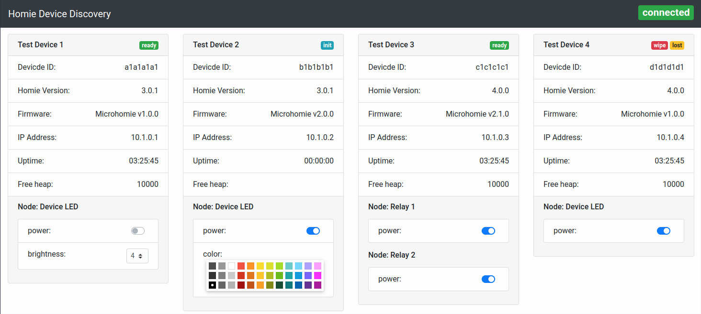

# HoDD - Homie Device Discovery

HoDD is a simple client-side (Browser) app to discover [Homie](https://homieiot.github.io) devices. It's a little helper for developing Homie devices or just to spot the amount of Homie devices you are running at home.

Currently supports [Homie convention v3.0.1](https://github.com/homieiot/convention/releases/tag/v3.0.1) (without arrays) and Homie v4.0.0 with legacy extensions.

### What's included

* Runs complete in your browser, no server side setup
* Auto discover devices and display them in cards with all attributes, nodes and properties
* Interact with settable properties, no data validation and only rgb support for color
* Click on node property name to copy the node property topic to clipboard
* Bonus: Obscure JavaScript and Vue.js source code, written by a SysAdmin learning something new

### In the future

* More bootstrap-vue, components, vue.js magic, etc.
* Homie 4 support (partly done)

### Installation

* Clone this repository or download the latest release archive
* Open the `index.html` file in your browser
* Click on `Settings` in the top-right corner

### Screenshot with example data

